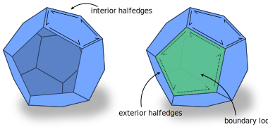

Mesh boundaries in halfedge meshes are modelled by logically treating each _boundary loop_ as if it were a face with an associated set of halfedges. These halfedges incident on boundary loops are referred to as _exterior halfedges_, while halfedges incident on faces actually present in the mesh are _interior halfedges_. Any boundary edge of the mesh will have one interior and one exterior halfedge incident upon it.

## Exterior halfedges

Generally speaking, most nearly all routines involving halfedges include both interior and exterior halfedges, as this is most often what is needed in algorithms. `HalfedgeData<>` containers can hold data on exterior halfedges, and iterators (like `VertexPtr::outgoingHalfedges`) will iterator over both interior and exterior halfedges.

A few routines explicitly indicate whether they process interior halfedges, exterior halfedges, or both, such as `HalfedgeMesh::nInteriorHalfedges()`.

??? func "`#!cpp bool HalfedgePtr::isInterior()`"
    **Return:** true if the halfedge is an interior halfedge, and false if it is an exterior halfedge.

## Faces and boundary loops

In some situations, boundary loops will be treated as faces of the mesh. For instance, calling `HalfedgePtr::face()` on an exterior face will yield a `FacePtr` to its boundary loop.  However, we have not really _added_ a face to a user's mesh: `HalfedgeMesh::nFaces()` will still report the input number of faces, etc. 

## Element boundary properties
